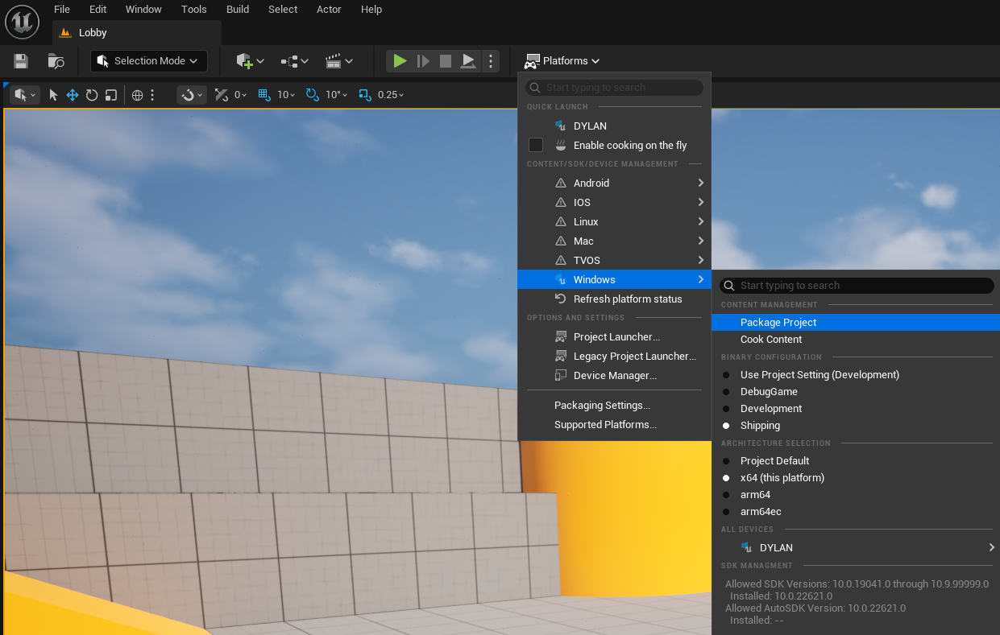

<div align="center">

<h1><i>Networking PvP</i></h1>

<h5><i>A real-time multiplayer FFA game</i></h5>

<h6><i>Platform: Windows (x64) / Engine : Unreal Engine (5.6.1)</i></h6>

</div>

# Setup
You will need :
 - [Unreal Engine 5.6.1](https://www.unrealengine.com/en-US/download) installed on your system
 - [Git](https://git-scm.com/install/windows) installed on your system.

 Then, run the following commands inside a terminal :
```bash
git clone https://github.com/Quest-Education-Group/par-2-atari-s2p1-19
cd par-2-atari-s2p1-19
```
Finally, open the `UE_Networking_PvP.uproject` file with Unreal Engine 5.6.1.

You should be good to go!

# Building the project
Inside Unreal Engine, go to `Platforms > Windows` and click `Package Project` after choosing the correct informations for your system.



# Project documentation
To read the project documentation, go to [DocumentationProjet.pdf](DocumentationProjet.pdf).

# License
This project is licensed under the [MIT License](LICENSE.txt).

<h3>
<div align="center"><i>Game made by Dylan Hollemaert.</i></div>
</h3>